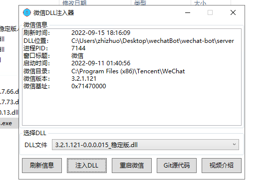
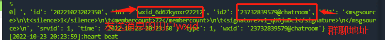
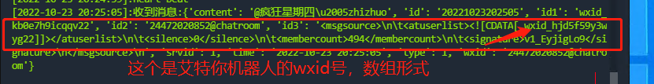

# WechatBot
一个基于PC版的微信机器人，采用hook的形式进行消息拦截，内存信息读取的形式获取通讯录，用户信息等

感谢@cixingguangming55555开发的server端以及集成化的hook利用程序，本项目是基于@cixingguangming55555大佬的开源项目进行的二开（玩法很多我慢慢开发吧，就这样吧）

这里需要使用的微信版本是**3.2.1.121**版本，历史版本下载地址

- https://github.com/tom-snow/wechat-windows-versions

## 部署教程

安装微信**3.2.1.121**版本，然后再打开ServerMain/server中的微信DLL注入器V1.0.3.exe工具进行dll注入

 

***注入完成使用命令curl http://127.0.0.1:5555 去测试一下是否注入成功，如果015不成功可以尝试使用018来注入或者下面其他的**

***或者可以使用微信版本为3.6.0.18，然后再使用对应的dll文件进行注入**

点击注入即可，然后接下来就是项目的config目录下面的config.ini的配置

***注意编辑config文件不要用txt打开会改变文件的类型，导致报错！！！**

config.ini详解

```
[server]
# 微信机器人服务端的配置文件
ip = 127.0.0.1
port = 5555
# 管理员wxid
admin_id = wxid_kb0e7h9icqqv22,wxid_6vxrrvjff6pg22,wxid_fys2fico9put22,wxid_lb33d6uyarmv22,
# 推送的微信群聊地址
room_id = 23117228686@chatroom,24472020852@chatroom,20809144388@chatroom,22261634025@chatroom,22868513156@chatroom,25348406777@chatroom,22108828312@chatroom,24749035253@chatroom,19752248739@chatroom,24303327388@chatroom,25455028831@chatroom
# 视频权限群聊地址
video_list_room_id = 19820015740@chatroom,23117228686@chatroom,25348406777@chatroom,20809144388@chatroom,25142607072@chatroom,39218917883@chatroom,24749035253@chatroom,19752248739@chatroom
# 群娱乐功能黑名单
blacklist_room_id = 24472020852@chatroom,
# 早报自动推送时间
set_time_am = 09:00
# 晚间资讯自动推送时间
set_time_pm = 17:00
# 推送今日黄历
set_time_am_today = 08:30
# 推送摸鱼日历
set_fish_time = 15:00
# 下班时间
after_work_time = 18:00
# 发工资日期
salary_day = 10

[apiService]
# openai用户key
openai_key = 
# 微步社区的key
threatbook_key = 自己去微步社区个人中心查看
threatbook_url = https://api.threatbook.cn/v3/scene/ip_reputation
# MD5解密接口
md5_url = 
# 舔狗日记接口
dog_url = http://api.tianapi.com/tiangou/index?key=自己的key
# 彩虹屁接口
fart_url = http://api.tianapi.com/caihongpi/index?key=自己的key
# 60s读懂世界
history_url = https://api.qqsuu.cn/api/dm-60s
# 查询天气接口
weather_url = https://www.tianqiapi.com/free/day?appid=自己的key&appsecret=自己的key&city=
# 美女视频接口
girl_videos_url = https://tucdn.wpon.cn/api-girl/
# 当日安全资讯
xz_url = https://xz.aliyun.com/feed
freebuf_url = https://www.freebuf.com/feed
qax_url = https://forum.butian.net/Rss
anquanke_url = https://www.anquanke.com/knowledge
# 搞笑段子接口
smile_url = https://www.mxnzp.com/api/jokes/list?app_id=自己的key&app_secret=自己的key&page=
# 今日黄历接口
zodiac_url = https://www.mxnzp.com/api/holiday/single/
allow_token = ?ignoreHoliday=false&app_id=自己的key&app_secret=自己的key
# 早安寄语接口
morning_url = https://api.qqsuu.cn/api/dm-zaoan
# 星座运势
constellation_url = http://api.tianapi.com/star/index?key=自己的key&astro=
# ai对话机器人接口
ai_reply_url = http://api.qingyunke.com/api.php?key=free&msg=
```

**admin_id是管理员ID，在程序跑起来之后你给机器人发送一个消息即可看见**

 

这个就是你的管理身份账号

***其中群里地址就是roomid在控制台中打印的msg中就能看见**

 

 

**舔狗日记和彩虹屁接口信息可以到https://www.tianapi.com进行注册获取**

## 项目启动

首先使用命令安装依赖

```bash
pip3 install -r requirements.txt
```

如果出现WebSocketApp no modle的报错，使用命令安装此依赖即可

```bash
pip3 install websocket-client-py3
```

然后使用命令即可启动项目

```bash
python3 main.py
```

***建议使用python3.8以上**

**如果其中有不需要的功能就不用配置config.ini中的api接口信息，其中config.ini中的配置文件和前面的一个处理函数是关联关系，删除或者注释config.ini的配置文件会引起报错项目无法启动，如果不需要可以将相关的处理函数注释点即可，如果有什么新的玩法可以提交Pr**

## 项目结构

### config

为项目的配置文件目录

### servercli

为项目的核心处理逻辑目录，主要是使用的websocket和http协议进行的通信

### httpcli

主要为接口的一些处理逻辑文件的目录，大部分的配置文件都是config目录中的，二者是关联关系

## 后续开发计划

- 实现每日咨询自动定时推送（暂时只可以管理员指定获取）（已完成）
- 新增黄历，段子，天气查询，美女视频等 （已完成）
- 新增AI只能对话功能，摸鱼日历功能等 （已完成）
- **已恢复舔狗日记**
- ***2022-11-04新增恶意ip查询，调用的微步接口，每天限制50次，修改早晚日报，修改部分代码逻辑**
- ***修复摸鱼日记diff算法错误，修改一处接口调用**
- ***开发计划：预计本月添加openai机器人，目前我阳了，等我转阴后实现此功能。**
- ***2023-02-01新增功能openai机器人功能**
- ***2023-02-22 bug修复功能说明，openai的调用关键词是Hey或者hey，出现不回复的情况一般是官方问题。同时发现一个bug，不支持英文版本的wechat，使用openai可以不用科学上网。**
- ***2023-03-20 新增chatgpt3.5，私聊支持连续对话，以及角色扮演，该代码提供由@[Xciny](https://github.com/NewBeginning6)提供**
- 实现GitHub实时监控
- 实现第三方工具实时推送
- 待定，有需求可以提交lessus

## 最后

代码写的烂，轻点喷，毕竟我这么菜，后续项目迭代看心情吧，就这样

## 温馨提示

尽量使用git命令进行克隆，不要使用zip压缩包下载模式，可能会造成程序跑不起来

git命令

```
git clone https://github.com/zhizhuoshuma/WechatBot.git
```

国内git加速命令

```
git clone https://github.91chi.fun/https://github.com/zhizhuoshuma/WechatBot.git
```

如果程序跑不起来，可以提交lessus，或者微信联系我，给我ssh或者rdp我上去帮你远程调试

## 参考资料

- https://github.com/Le0nsec/SecCrawler
- https://github.com/tom-snow/wechat-windows-versions
